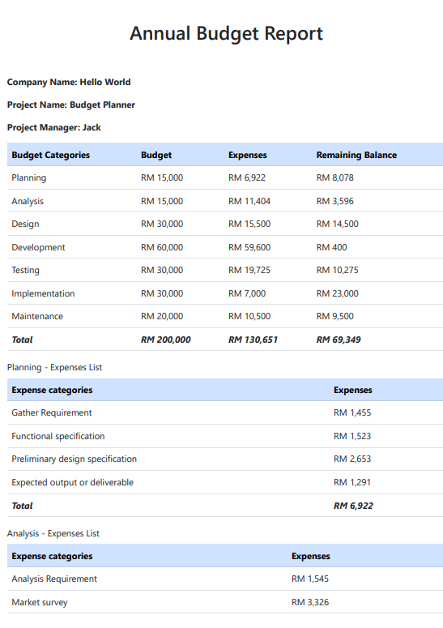
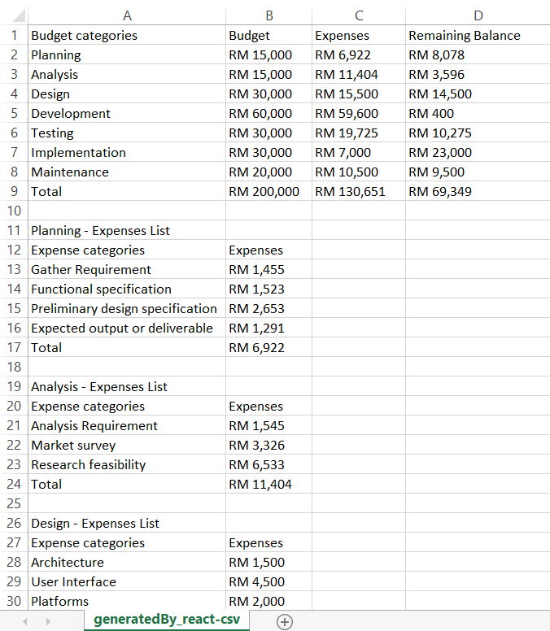

 

<h2 align="center">💲 React Budget Planner 💵</h2>

---

### 🔎 What is this app for?
Do you or your business often go over budget with unnecessary spending, leading to the dilemma of interrupted cash flow? This is an application that wants to help you know exactly where your money is being spent. Knowing where every pound is spent is an essential step towards getting out of debt or getting your company's performance up to scratch. Good planning and management can effectively prevent companies or individuals from disrupting the flow of funds and leading to bankruptcy. To avoid these things happening we must prepare in advance, set a budget in advance, and stick to it.

#### 🎉 This application enables you to:
1. Set a budget in advance
2. Record all your spending
3. Break down your finances by category
4. A progress bar will show whether the expenditure has exceeded the budget
5. After completion, you can print the data to PDF or CSV for storage.

---

### 📢 Features Demo 

---

### 🎁 PDF & CSV Sample

        |  
:-------------------------:|:-------------------------:
PDF                        |            CSV

---

### 🎈 Deploy on Vercel

### 👉 [Live Demo](https://react-budget-planner-ten.vercel.app/ "Budget Planner")

---

### 🪛 Getting Started

The quickest way to get started as shown below:

#### `npm i && npm start`

Runs the app in the development mode.\
Open [http://localhost:3000](http://localhost:3000) to view it in your browser.

---

### 🚩 [Reference](https://youtu.be/yz8x71BiGXg "Reference")